# TOR2E - Theme
A Foundry VTT theme for *The One Ring 2nd Edition*. It applies the typography and color scheme from the core rulebook.

---

## Screenshots

### Core Customizations 

| 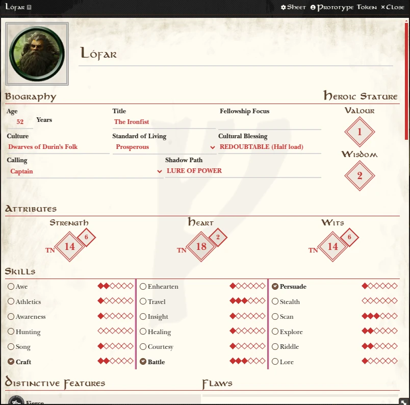 | 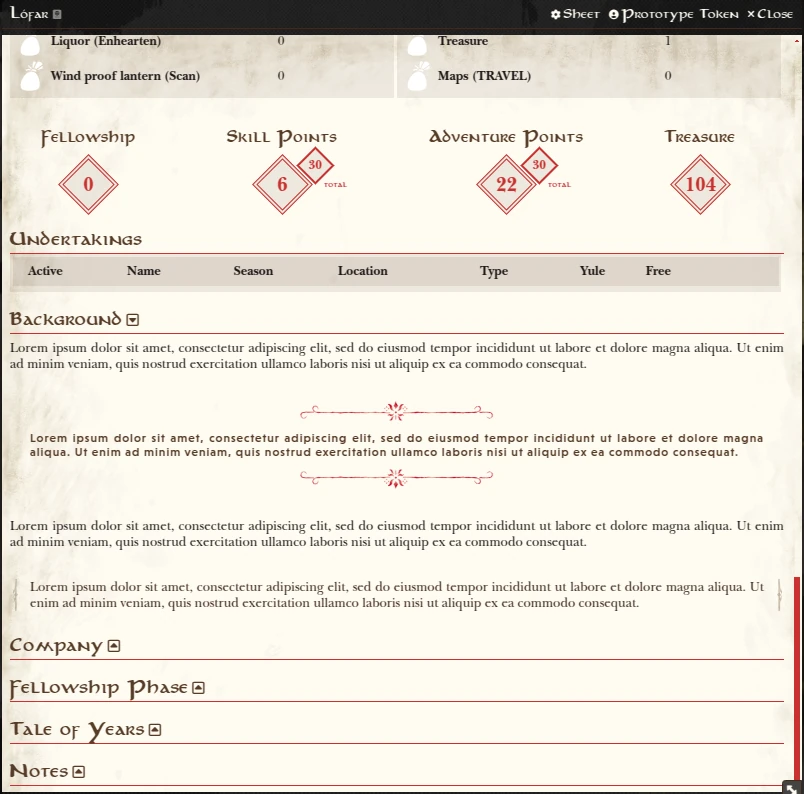 |  
|:--:|:--:|  
| **Character Sheet - Top** | **Character Sheet - Bottom** |  

| 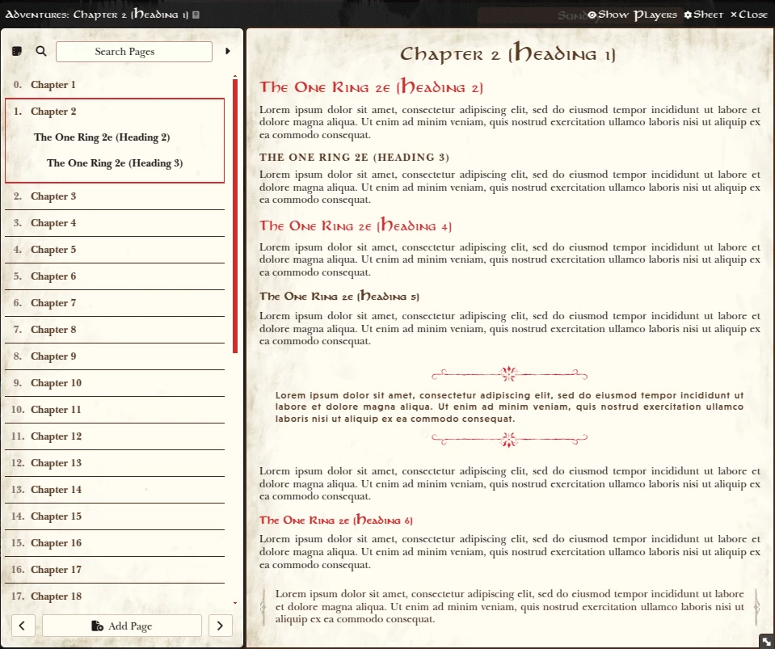 | 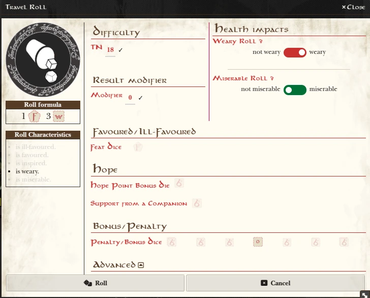 |  
|:--:|:--:|  
| **Journal** | **Dice Roll Dialogue** |  

| 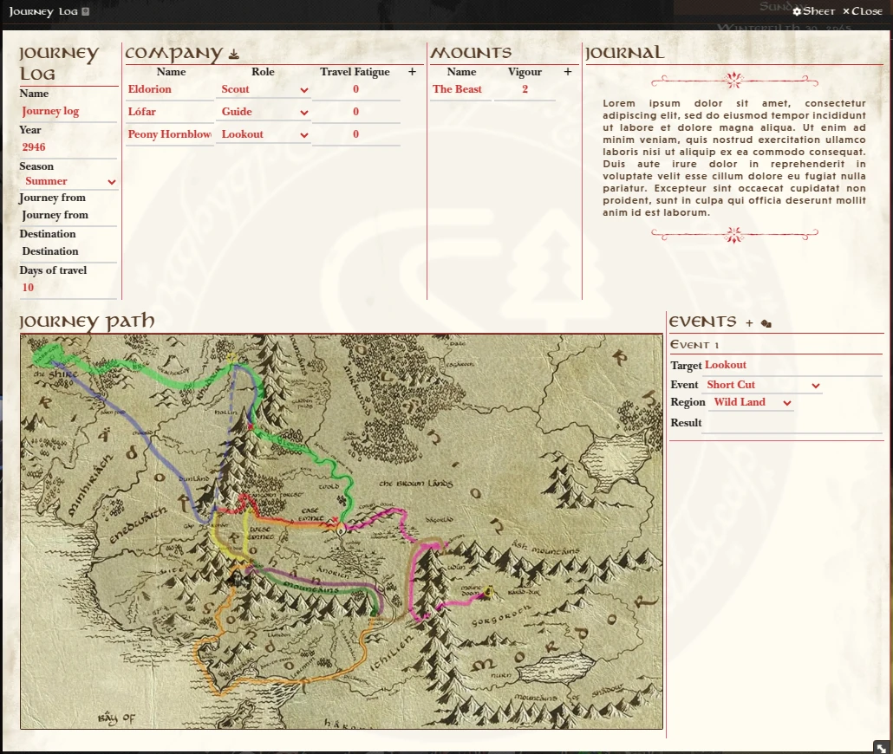 |
|:--:|
| **Journey Log** |  

| 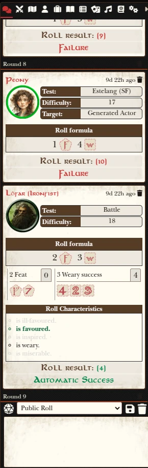 |  |  
|:--:|:--:|  
| **Sidebar - Chat** | **Sidebar - Items** |  

### Module Customizations
| 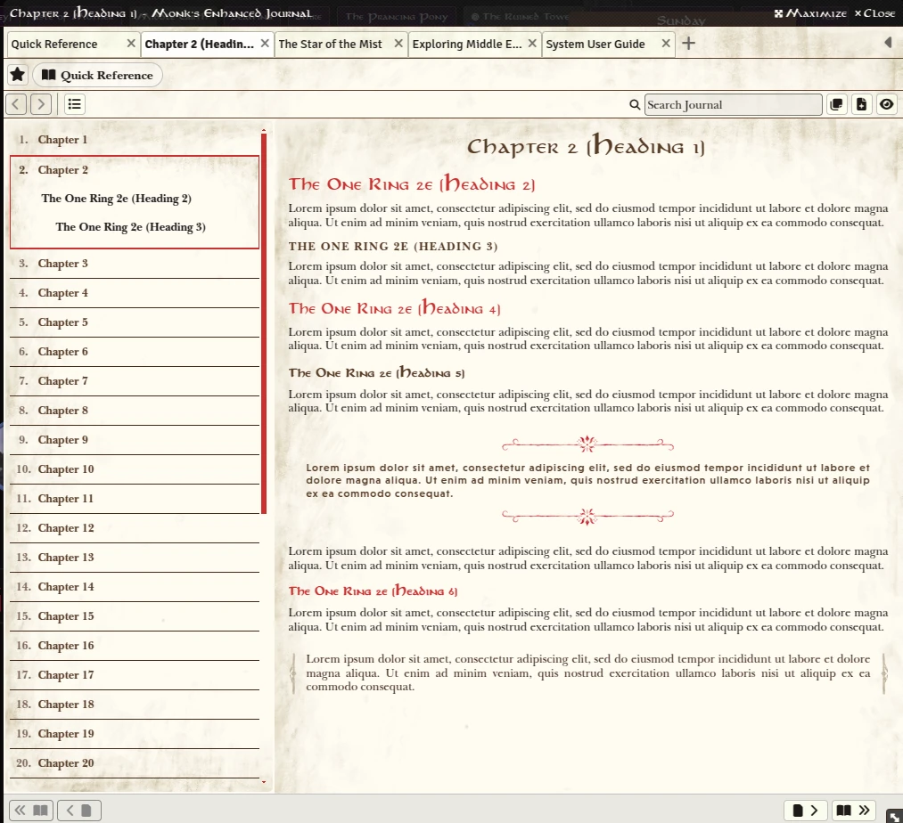 | 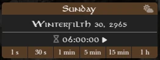 | 
|:--:|:----------------------------------------------------:|  
| **Monk's Enhanced Journal** |**Weather Control**|  

| 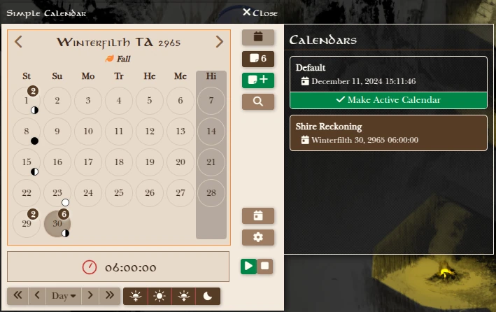 | 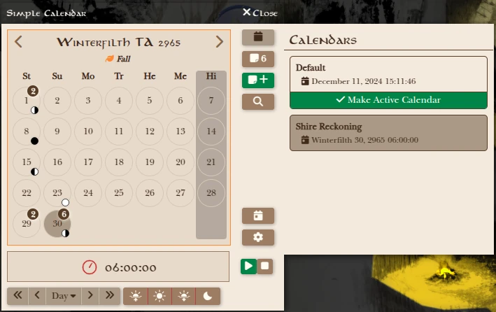 | 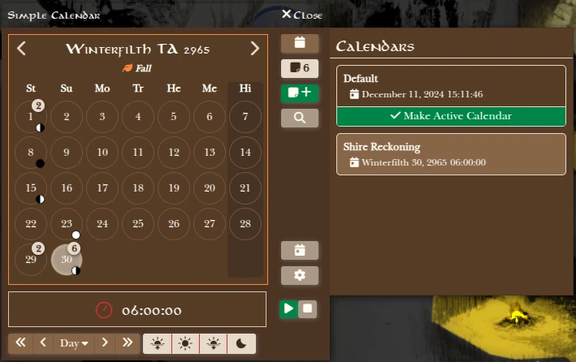 |  
|:--:|:--:|:--:|  
| **Simple Calendar - Classic** | **Simple Calendar - Light** | **Simple Calendar - Dark** |  
