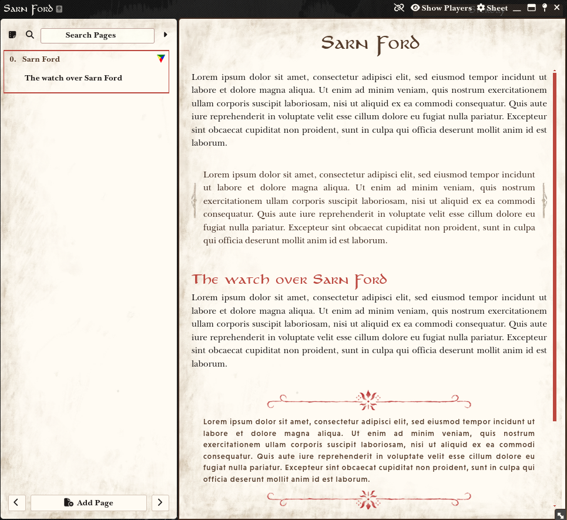
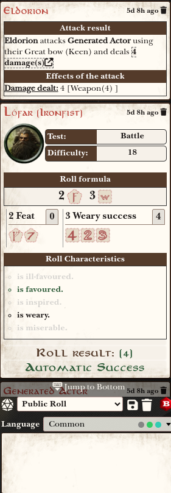
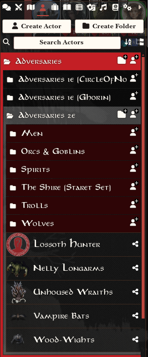
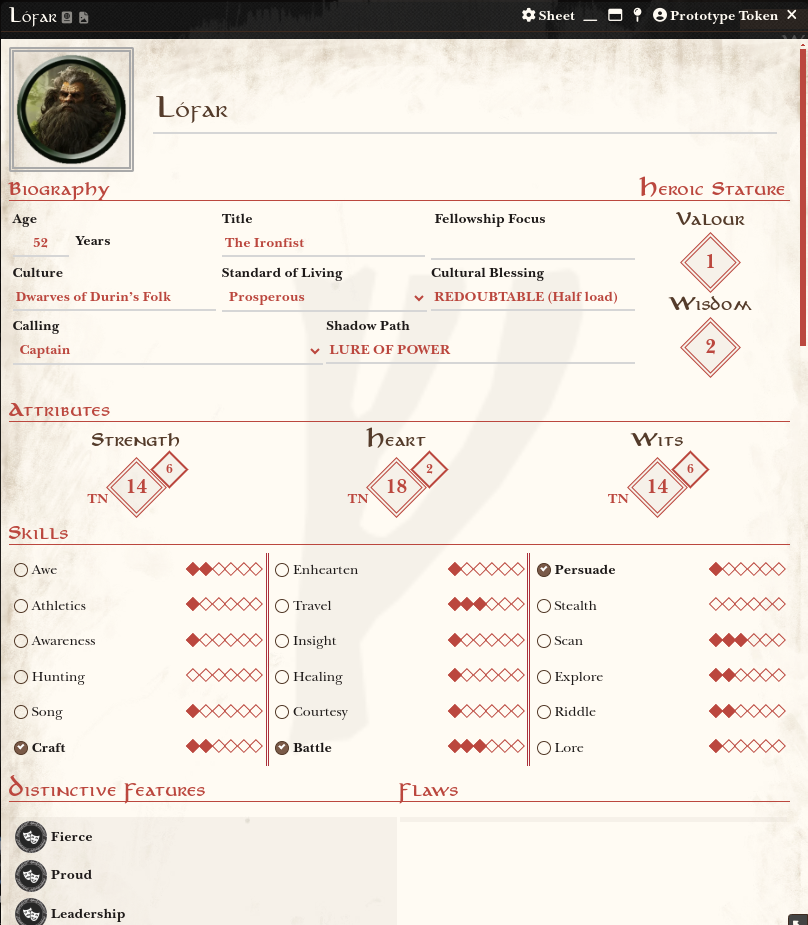
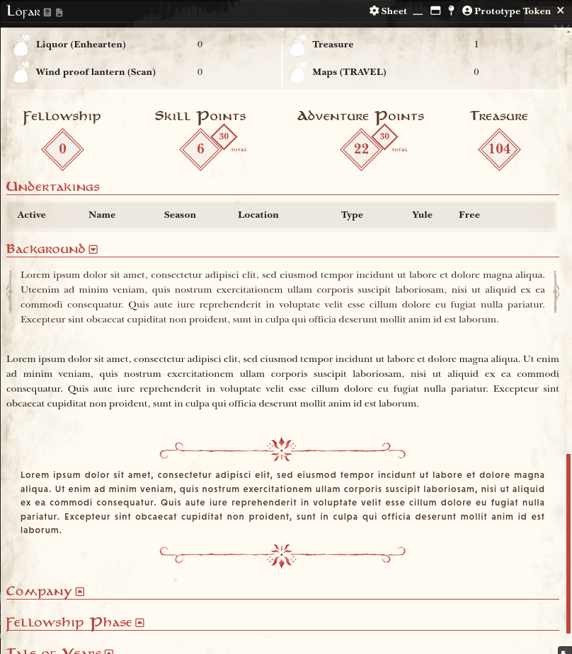
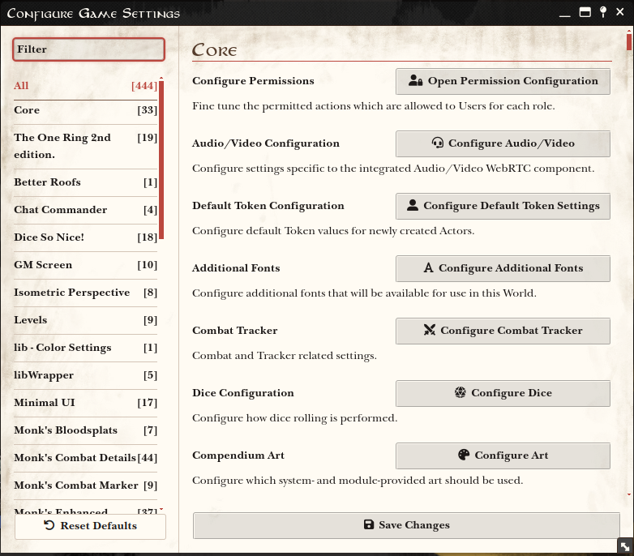
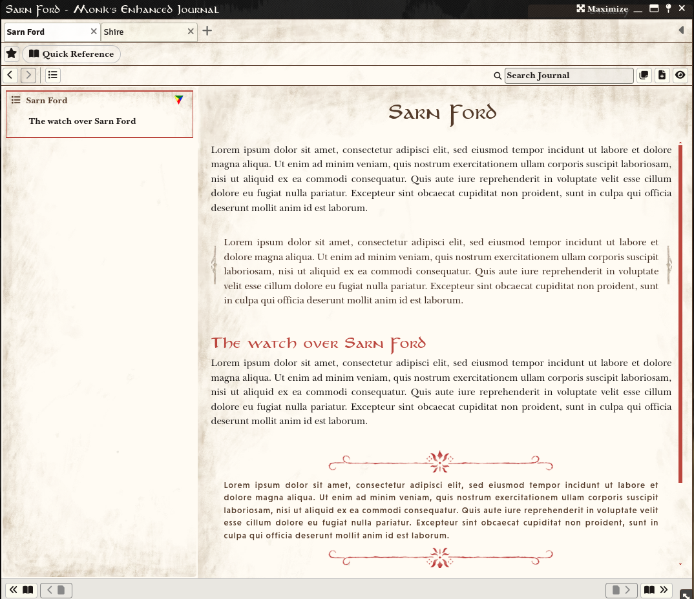
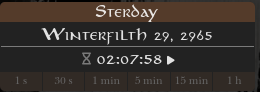

# TOR2E - Theme
A Foundry VTT theme for The One Ring 2nd Edition. It applies the typography and color scheme from the core rulebook.

## Journal

## Sidebar
|  |  |

## Character Sheet

## Actor Description

## Dialogues

## Monk's Enhanced Journal

## Weather Control

# Changelog
0.1.0 (2025-02-02)

Alpha version with support for the TOR2E system, TOR2E macros, as well as the Monk’s Enhanced Journal and Weather Control plugins.  
