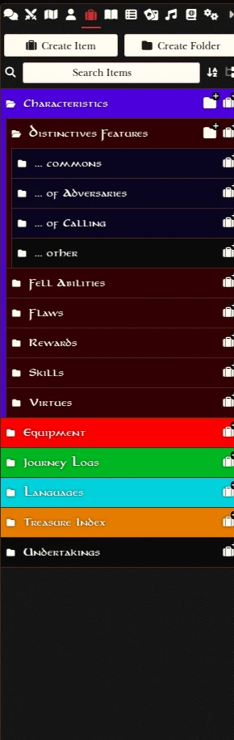

# TOR2E - Theme
A Foundry VTT theme for *The One Ring 2nd Edition*. It applies the typography and color scheme from the core rulebook.

---

## Screenshots

### Core Customizations 

|  |  |  
|:--:|:--:|  
| **Character Sheet - Top** | **Character Sheet - Bottom** |  

|  |  |  
|:--:|:--:|  
| **Journal** | **Dice Roll Dialogue** |  

|  |
|:--:|
| **Journey Log** |  

|  |  |  
|:--:|:--:|  
| **Sidebar - Chat** | **Sidebar - Items** |  

### Module Customizations
|  |  | 
|:--:|:----------------------------------------------------:|  
| **Monk's Enhanced Journal** |**Weather Control**|  

|  |  |  |  
|:--:|:--:|:--:|  
| **Simple Calendar - Classic** | **Simple Calendar - Light** | **Simple Calendar - Dark** |  

# Changelog

### 0.7.0 (2025-02-07)
- Fixes font color in compendiums
- Adds support for Simple Calendar plugin (classic, dark, and light themes)

### 0.6.0 (2025-02-05)
- Fixes h4 fonts in actor screens

### 0.5.0 (2025-02-05)
- Fixes font size for heading 1

### 0.4.0 (2025-02-05)
- Improved headings spacing and letter size
- Added compatibility with TOR2E Macros module
- Added support for Latin-1 charset

### 0.3.0 (2025-02-04)
- Tweaked font sizes for better readability

### 0.2.0 (2025-02-03)
- Optimized the theme for a more compact design, maximizing space efficiency
- Ensured global Foundry UI/UX consistency

### 0.1.0 (2025-02-02)
- Alpha 1 version with support for the TOR2E system, TOR2E Macros, Monk’s Enhanced Journal, and Weather Control plugins  